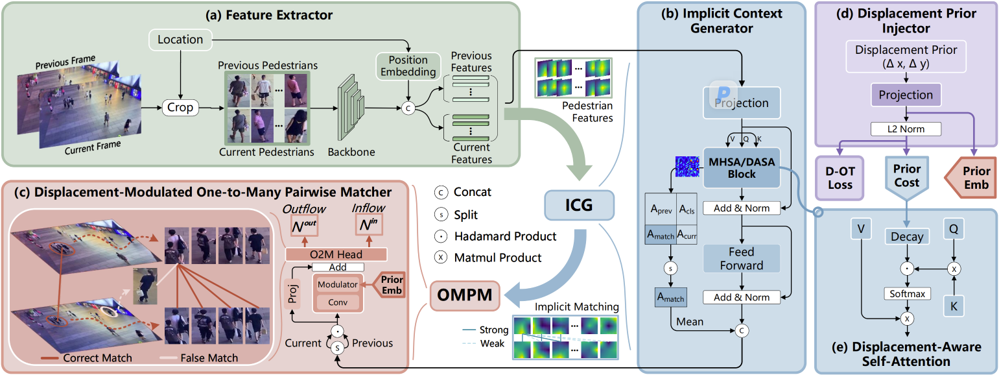

# Crowded Video Individual Counting Informed by Social Grouping and Spatial-Temporal Displacement Priors (OMAN++)

This repository includes the implementation of the manuscript:

[**Crowded Video Individual Counting Informed by Social Grouping and Spatial-Temporal Displacement Priors**](https://github.com/tiny-smart/OMAN) (TIP)

Hao Lu<sup>1</sup>, Xuhui Zhu<sup>1</sup>, Wenjing Zhang<sup>1</sup>, Yanan Li<sup>2</sup>, Xiang Bai<sup>1</sup>

<sup>1</sup>Huazhong University of Science and Technology, China

<sup>2</sup>Wuhan Institute of Technology, China

[[Manuscript (TIP)]](doc/OMAN++.pdf) | Transaction Version (todo) | [[Previous Conference Version (OMAN, ICIP 2025)]](https://arxiv.org/abs/2506.13067) | [[Code]](https://github.com/tiny-smart/OMAN/OMAN++)




## Overview

Video Individual Counting (VIC) aims to estimate foot traffic by counting unique pedestrians in a video, which is essentially a correspondence problem between frames. Existing VIC approaches mostly follow a one-to-one (O2O) matching strategy conditioned on appearance only, and therefore underperform in crowded scenes such as metro commuting.

This work rethinks the nature of VIC and recognizes two informative priors:

- **Social grouping prior**: pedestrians tend to gather in groups, which inspires relaxing the O2O matching to a **one-to-many (O2M) matching**, implemented by an **Implicit Context Generator (ICG)** and a **One-to-Many Pairwise Matcher (OMPM)**;
- **Spatial-temporal displacement prior**: an individual cannot teleport physically, which facilitates a **Displacement Prior Injector (DPI)** that strengthens O2M matching, feature extraction, and model training via a **Displacement-Aware Self-Attention (DASA)** block, a **displacement modulator**, and a **displacement-informed Optimal Transport (D-OT) loss**.

These designs jointly form **OMAN++**, a simple but strong VIC baseline. To fill the data gap of crowded scenes, we further build **WuhanMetroCrowd**, one of the first VIC datasets characterized by crowded, dynamic pedestrian flows: 80 surveillance videos from 15 metro stations, 11,925 frames (2-second sampling), and 223,662 manually annotated pedestrians with inflow/outflow labels.

### What's New Compared with OMAN (ICIP 2025)

- A novel crowded VIC benchmark, **WuhanMetroCrowd**, featuring long sequences, large density/flow variations, and severe occlusions;
- The **spatial-temporal displacement prior** with three synergistic modules: DASA, the displacement-modulated matcher, and the D-OT loss;
- Cross-frame displacement-aware self-attention and a displacement-modulated O2M matcher;
- Comprehensive experiments on **four** benchmarks (SenseCrowd, CroHD, MovingDroneCrowd, WuhanMetroCrowd) with consistent improvements over the state of the art.

## Repository Structure

```
OMAN++
├── train.py                  # training entry (SENSE / HT21 / Metro / UAVVIC / Drone)
├── test.py                   # inference on SenseCrowd
├── test_HT21.py              # inference on CroHD (HT21)
├── test_Metro.py             # inference on WuhanMetroCrowd
├── engine.py                 # training / evaluation loops (VIC metrics)
├── eval_metrics_Drone.py     # evaluation on MovingDroneCrowd
├── eval_metrics_HT21.py      # evaluation on CroHD (HT21)
├── eval_metrics_Metro.py     # evaluation on WuhanMetroCrowd (per-scene WRAE, etc.)
├── my_plot*.py               # qualitative visualization (draw / draw_pair / draw_failure)
├── models/
│   ├── pet.py                # locator (PET) + VIC pipeline
│   ├── vic.py                # ICG + OMPM (coarse-to-fine matcher) + displacement encoder
│   ├── tri_sim_ot_b.py       # displacement-informed optimal transport (D-OT) loss
│   ├── transformer/          # transformer encoder with DASA
│   └── backbones/            # ConvNeXt-S / VGG16 backbones
└── datasets/                 # SenseCrowd / HT21 / Metro / UAVVIC / MovingDroneCrowd loaders
```

## Installation

Clone and set up the OMAN repository:

```
git clone https://github.com/tiny-smart/OMAN
cd OMAN
conda create -n OMAN++ python=3.9
conda activate OMAN++
pip install -r requirements.txt
```

> Note: OMAN++ shares the environment and the `requirements.txt` (e.g., `torch==2.0.1`, `torchvision==0.15.2`, `timm==0.9.2`, `geomloss==0.2.6`) at the repository root. If some shared utilities (e.g., `util/misc.py`) are not found, add the repository root to `PYTHONPATH`.

## Data Preparation

| Dataset | View | Frame Interval σ | Annotation |
| :-- | :-- | :-- | :-- |
| [SenseCrowd](https://github.com/HopLee6/VSCrowd-Dataset) | Surveillance | 15 (3s) | ID → inflow/outflow |
| CroHD (HT21) | Drone | 75 (3s) | ID → inflow/outflow |
| [MovingDroneCrowd](https://github.com/taohan10200/VIPT) | Drone | 4 | ID → inflow/outflow |
| UAVVIC | Drone | 1 (3s) | Inflow/outflow |
| **WuhanMetroCrowd (Ours)** | Surveillance | 1 (2s) | Inflow/outflow/pedestrian/mask |

- SenseCrowd: download from [Baidu disk](https://pan.baidu.com/s/1OYBSPxgwvRMrr6UTStq7ZQ?pwd=64xm#list/path=%2F) or the [original dataset link](https://github.com/HopLee6/VSCrowd-Dataset).
- CroHD / MovingDroneCrowd / UAVVIC: please prepare the datasets following their official instructions.
- WuhanMetroCrowd: 80 surveillance videos collected from 15 Wuhan metro stations during peak hours, holidays, and festivals (2023–2025), covering scenes of platform, transfer, fare gate, escalator, security, exit/entrance, and lobby. Videos are split into 45 / 15 / 20 sequences for training / validation / testing.

Place the prepared datasets and point the `--train_root`, `--val_root`, `--test_root`, and `--ann_dir` arguments of `train.py` / `test_*.py` to the corresponding paths. Annotations are expected in X-AnyLabeling JSON format with labels `pedestrian`, `inflow`, `outflow`, `both`, and `mask`; HT21 follows the MOT format (`img1/`, `det/det.txt`, `gt/gt.txt`).

## Training

- Download ImageNet pretrained ConvNeXt-S [[Baidu disk]](https://pan.baidu.com/s/1oxxcD6h-JiRdJ4VItHJIUQ?pwd=ubqt) [[Google drive]](https://drive.google.com/file/d/1tDGb3DAEITajJ5xlzYSxCa5x4dnTbfJ-/view?usp=sharing), and put it in the ```pretrained``` folder. Or define your pre-trained model path in [models/backbones/backbone_vgg.py](models/backbones/backbone_vgg.py).
- Select the dataset by `--dataset_file` (`SENSE` / `HT21` / `Metro` / `UAVVIC` / `Drone`) and set the corresponding roots in `train.py`, then run

```
python train.py
```

or launch with multiple GPUs (see `train.sh`):

```
CUDA_VISIBLE_DEVICES='0,1,2,3' python -m torch.distributed.launch \
    --nproc_per_node=4 --master_port=10001 --use_env train.py
```

Training follows CGNet: learning rate and weight decay are both 1e-4, the D-OT loss weight λ is 0.1, pedestrian patches are cropped at a fixed size of 96×64 pixels, and the frame interval σ is set automatically per dataset (15 for SenseCrowd, 75 for CroHD/HT21, 4 for MovingDroneCrowd, 1 for Metro/UAVVIC). The model is trained on 4 RTX 3090 GPUs with a per-GPU batch size of 1.

## Inference

- To test OMAN++ on different datasets, run

```
# SenseCrowd
python test.py

# CroHD (HT21)
python test_HT21.py

# WuhanMetroCrowd
python test_Metro.py
```

Checkpoint paths can be changed via `--resume`. Results are saved to `outputs/json/video_results_test.json`.

## Evaluation

- To evaluate the results after testing, run the corresponding evaluation script:

```
# MovingDroneCrowd
python eval_metrics_Drone.py

# CroHD (HT21)
python eval_metrics_HT21.py

# WuhanMetroCrowd (reports MAE / MSE / WRAE, per-scene and density-level results)
python eval_metrics_Metro.py
```

Metrics: MAE, MSE, and the standard VIC metric WRAE (Weighted Relative Absolute Error).

## Visualization

- To visualize per-frame counts, frame-pair matches, and failure cases, run (uncomment the `draw*` calls in `test_*.py` as needed):

```
python my_plot.py            # SenseCrowd
python my_plot_Drone.py      # MovingDroneCrowd
python my_plot_HT21.py       # CroHD (HT21)
python my_plot_Metro.py      # WuhanMetroCrowd
```

## Results

Environment:

```
python==3.9
pytorch==2.0.1
torchvision==0.15.2
```

Main results (MAE / MSE / WRAE):

| Dataset | MAE | MSE | WRAE |
| WuhanMetroCrowd | 87.1 | 160.2 | 19.8% |

On the three public benchmarks, OMAN++ outperforms state-of-the-art VIC baselines without additional pretraining by 10.5%∼34.7% in MAE, 2.9%∼20.9% in MSE, and 5.5%∼26.2% in WRAE; on WuhanMetroCrowd it reduces MAE, MSE, and WRAE by 47.5%, 63.6%, and 38.1%, respectively, compared with SDNet. Pretrained models will be released at the [repository](https://github.com/tiny-smart/OMAN).

## Citation

If you find this work helpful for your research, please consider citing:

```
todo
```

## Permission

This code is for academic purposes only. Contact: Xuhui Zhu (XuhuiZhu@hust.edu.cn)

## Acknowledgement

We thank FiberHome Telecommunication Technologies Co., Ltd. and Wuhan Metro Group Co., Ltd. for sharing the data of WuhanMetroCrowd.
