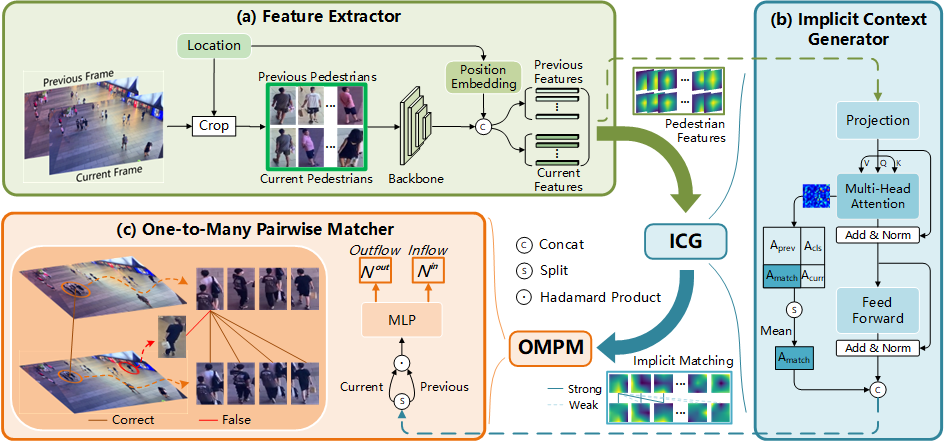

# Video Individual Counting With Implicit One-to-many Matching (ICIP 2025)

This repository includes the official implementation of the paper:

[**Video Individual Counting With Implicit One-to-many Matching**](https://arxiv.org/abs/2308.13814)

International Conference on Image Processing (ICIP), 2025

Xuhui Zhu<sup>1</sup>, Jing Xu<sup>2</sup>,Bingjie Wang<sup>1</sup>,Huikang Dai<sup>2</sup>,[Hao Lu](https://sites.google.com/site/poppinace/)<sup>1</sup>

<sup>1</sup>Huazhong University of Science and Technology, China
<sup>2</sup>FiberHome Telecommunication Technologies Co., Ltd., China
<sup>3</sup>University of Rochester, Rochester, USA

[[Paper]](TODO) | [[Code]](https://github.com/tiny-smart/OMAN)



## Overview

Video Individual Counting (VIC) aims to estimate pedestrian flux from a video. Existing VIC approaches, however, mainly follow a one-to-one (O2O) matching strategy where the same pedestrian must be exactly matched between frames, leading to sensitivity to appearance variations or missing detections. In this work, we show that the O2O matching could be relaxed to a one-to-many (O2M) matching problem, which better fits the problem nature of VIC and can leverage the social grouping behavior of walking pedestrians. We therefore introduce OMAN, a simple but effective VIC model with implicit One-to-Many mAtchiNg, featuring an implicit context generator and a one-to-many pairwise matcher. Experiments on the SenseCrowd and CroHD benchmarks show that OMAN achieves the state-of-the-art performance.

## Installation

Clone and set up the CGNet repository:

```
git clone TODO
cd OMAN
conda create -n OMAN python=3.9
conda activate OMAN
pip install -r requirements.txt
```


## Data Preparation

- SenseCrowd: Download the dataset from [Baidu disk](https://pan.baidu.com/s/1OYBSPxgwvRMrr6UTStq7ZQ?pwd=64xm#list/path=%2F) or from the original dataset [link](https://github.com/HopLee6/VSCrowd-Dataset).


## Inferrence

- Download ImageNet pretrained ConvNext[[baidu dist]](https://pan.baidu.com/s/1oxxcD6h-JiRdJ4VItHJIUQ?pwd=ubqt)[[Google drive]](https://drive.google.com/file/d/1tDGb3DAEITajJ5xlzYSxCa5x4dnTbfJ-/view?usp=sharing), and put it in ```pretrained``` folder. Or you can define your pre-trained model path in [models/backbones/backbone.py](models/backbones/backbone.py)
- To test OMAN on SenseCrowd dataset, run

```
python test.py
```


## Evaluation

- To evaluate the results after testing, run

```
python eval_metrics.py
```


## Pretrained Models

- Environment:

```
python==3.9
pytorch==2.0.1
torchvision==0.15.2
```

- Models:

| Dataset | Model Link | MAE | MSE | WRAE |
| :-- | :-- | :-- | :-- | :-- |
| SenseCrowd | SENSE.pth[[Baidu disk]](https://pan.baidu.com/s/1ZWxReVf9QeePRTsVwu9sIg?pwd=9a8c)[[Google drive]](https://drive.google.com/file/d/1XKBnOscinhDot4blvQQtFx3IgrZQ8Wae/view?usp=sharing) | 8.58 | 16.80 | 10.89% |

## Citation

If you find this work helpful for your research, please consider citing:

```
TODO
```


## Permission

This code is for academic purposes only. Contact: Xuhui Zhu (XuhuiZhu@hust.edu.cn)

## Acknowledgement

We thank the authors of [CGNet](https://github.com/streamer-AP/CGNet) and [PET](https://github.com/cxliu0/PET) for open-sourcing their work.

